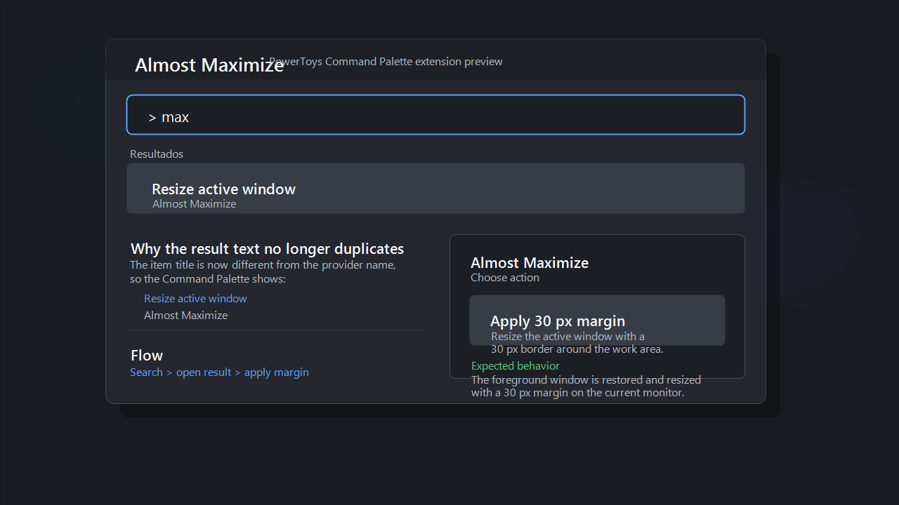

# Almost Maximize

Almost Maximize is an open-source PowerToys Command Palette extension for Windows.

It is a vibe-coded side project inspired by the "almost maximize" feel from Apple window management, but adapted for the PowerToys Command Palette on Windows.

The extension resizes the current foreground window so it fills the monitor work area while keeping a configurable margin around the edges.



## What It Does

- Adds an `Almost Maximize` action to the PowerToys Command Palette
- Resizes the active window immediately using the default `30 px` margin
- Adds a `Choose margin` action with presets:
  - `20 px`
  - `30 px`
  - `40 px`
  - `50 px`
  - `60 px`
- Uses the current monitor work area, so the taskbar and reserved desktop space are respected

## Why This Exists

Sometimes full maximize is too aggressive, but manual resizing is annoying.

This extension aims for the middle ground:

- fast like a window manager shortcut
- visual like an "almost maximized" layout
- easy to trigger from the PowerToys Command Palette

## Current Command Palette Flow

Top-level actions:

- `Almost Maximize`
  Runs immediately with a `30 px` margin.
- `Choose margin`
  Opens a page with the `20 / 30 / 40 / 50 / 60 px` presets.

## Project Structure

- `AlmostMaximize/AlmostMaximizeCommandsProvider.cs`
  Defines the top-level Command Palette entries.
- `AlmostMaximize/Pages/AlmostMaximizePage.cs`
  Defines the preset selection page.
- `AlmostMaximize/AlmostMaximizeCommand.cs`
  Contains the resize command and Win32 window resizing logic.
- `AlmostMaximize/Package.appxmanifest`
  MSIX package manifest for the extension host.
- `install-local.ps1`
  Helper script for local installation of the generated MSIX package.
- `docs/almost-maximize-preview-realistic.png`
  Preview/mockup used in this repository.

## Documentation

- [Local setup](docs/LOCAL_SETUP.md)
- [Architecture](docs/ARCHITECTURE.md)

## Requirements

- Windows 11
- PowerToys with Command Palette enabled
- .NET SDK
- Developer Mode enabled in Windows for local sideloading

## Local Development

### 1. Build

```powershell
dotnet build .\AlmostMaximize\AlmostMaximize.csproj -p:RuntimeIdentifier=win-x64
```

### 2. Publish an MSIX package

```powershell
dotnet publish .\AlmostMaximize\AlmostMaximize.csproj -c Release -p:Platform=x64 -p:GenerateAppxPackageOnBuild=true -p:AppxPackageSigningEnabled=false -p:AppxPackageDir=AppPackages\x64-manual\
```

### 3. Install locally

This project includes a helper script:

```powershell
.\install-local.ps1
```

If Windows blocks installation, make sure:

- Developer Mode is enabled
- the local signing certificate is trusted
- PowerToys is restarted after reinstalling the package

## Icons And Assets

For the Command Palette result icon, the safest format is:

- PNG
- transparent background
- `24x24 px`

The current result icon file is:

- `AlmostMaximize/Assets/Square44x44Logo.targetsize-24_altform-unplated.png`

The repository also includes generated package assets such as:

- `Square44x44Logo`
- `Square150x150Logo`
- `Wide310x150Logo`
- `SplashScreen`
- `StoreLogo`

## Troubleshooting

### The extension does not appear in Command Palette

- Confirm the package is installed
- Restart PowerToys
- Reopen Command Palette
- Check logs under:
  - `%LOCALAPPDATA%\Microsoft\PowerToys\CmdPal\Logs`

### The icon does not update

- Restart PowerToys completely
- Reinstall the local MSIX package
- Replace the `24x24` icon file and rebuild

### Windows blocks the MSIX install

Typical causes:

- Developer Mode disabled
- certificate not trusted
- package version/content mismatch during reinstall

## Notes

- This is an independent community project
- It is inspired by Apple window behavior, but it is not affiliated with Apple or Microsoft
- The current implementation focuses on local usage through PowerToys Command Palette

## License

MIT. See [LICENSE](LICENSE).
