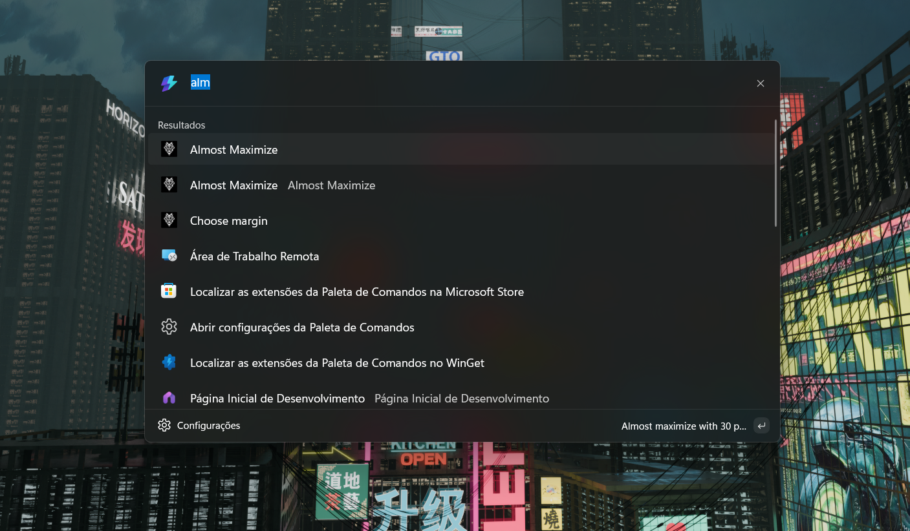

# Almost Maximize

Uma extensão open-source para o PowerToys Command Palette que redimensiona a janela ativa para quase preencher a tela — com uma margem configurável nas bordas.

Inspirada no comportamento de gerenciamento de janelas do macOS, mas feita para o Windows com o PowerToys.



## O que faz

Às vezes maximizar é demais, mas redimensionar na mão é chato. Essa extensão fica no meio-termo: abre a janela grande o suficiente para parecer confortável, mas sem encostar nas bordas.

No Command Palette, aparecem duas ações:

- **Almost Maximize** — redimensiona na hora com margem padrão de 30 px
- **Choose margin** — abre uma lista com presets: 20, 30, 40, 50 e 60 px

A posição respeita a área útil do monitor, então taskbar e espaços reservados ficam de fora.

## Requisitos

- Windows 11
- PowerToys com Command Palette ativado
- .NET SDK
- Developer Mode habilitado (para sideload local)

## Instalação local

**Build:**

```powershell
dotnet build .\AlmostMaximize\AlmostMaximize.csproj -p:RuntimeIdentifier=win-x64
```

**Publicar o pacote MSIX:**

```powershell
dotnet publish .\AlmostMaximize\AlmostMaximize.csproj -c Release -p:Platform=x64 -p:GenerateAppxPackageOnBuild=true -p:AppxPackageSigningEnabled=false -p:AppxPackageDir=AppPackages\x64-manual\
```

**Instalar:**

```powershell
.\install-local.ps1
```

Se o Windows bloquear a instalação, confirme que o Developer Mode está ativo, que o certificado local é confiável, e reinicie o PowerToys depois.

## Estrutura do projeto

| Arquivo                             | O que faz                             |
| ----------------------------------- | ------------------------------------- |
| `AlmostMaximizeCommandsProvider.cs` | Define as entradas do Command Palette |
| `Pages/AlmostMaximizePage.cs`       | Página de seleção de margem           |
| `AlmostMaximizeCommand.cs`          | Lógica de redimensionamento via Win32 |
| `Package.appxmanifest`              | Manifesto do pacote MSIX              |
| `install-local.ps1`                 | Script de instalação local            |

## Ícones

O ícone que aparece nos resultados do Command Palette fica em:

[`Square44x44Logo.targetsize-24_altform-unplated.png`](AlmostMaximize/Assets/Square44x44Logo.targetsize-24_altform-unplated.png)

Use PNG com fundo transparente em 24×24 px. O repositório também inclui os assets padrão do pacote MSIX (Square150x150Logo, Wide310x150Logo, StoreLogo etc.).

## Troubleshooting

**A extensão não aparece no Command Palette**
Reinstale o pacote, reinicie o PowerToys e reabra o Command Palette. Se continuar sem aparecer, veja os logs em `%LOCALAPPDATA%\Microsoft\PowerToys\CmdPal\Logs`.

**O ícone não atualiza**
Reinicie o PowerToys depois de reinstalar. Se precisar, troque o arquivo de ícone 24×24 e rebuilde.

**O Windows bloqueia a instalação do MSIX**
Causas mais comuns: Developer Mode desabilitado, certificado não confiável, ou conflito de versão ao reinstalar sem remover o pacote anterior.

## Documentação

- [Setup local](docs/LOCAL_SETUP.md)
- [Arquitetura](docs/ARCHITECTURE.md)

## Notas

Projeto comunitário independente, sem vínculo com Apple ou Microsoft. A implementação atual foca em uso local via PowerToys Command Palette.

## License

MIT. See [LICENSE](LICENSE).
